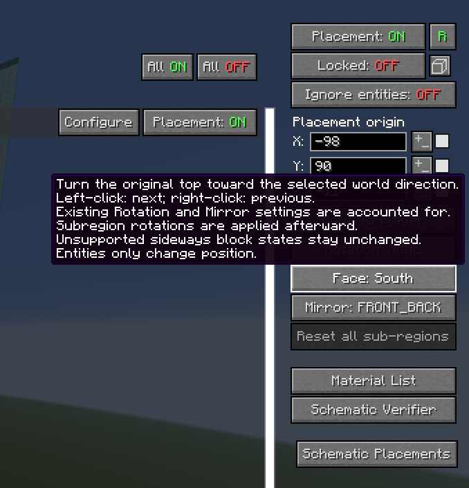
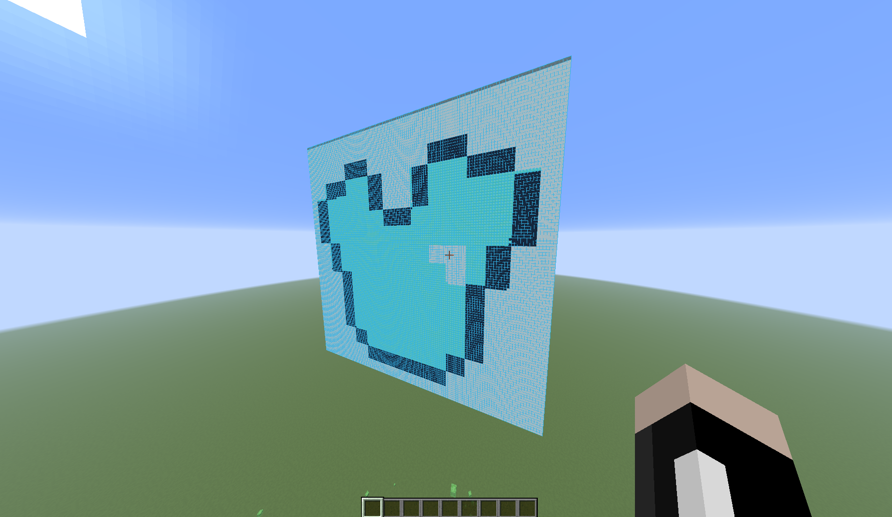

*DISCLAIMER:* **WORKS WITH LITEMATICA PRINTER, REQUIRES INSTALLTION OF FABRIC API**

## Litematica Vertical Rotation
Litematica is a client-side Minecraft mod using LiteLoader.

Litematica Vertical Rotation is a client-side Minecraft mod using Fabric.

Litematica Vertical Rotation is Litematica with vertical placement rotations.

This mod is intended for lazy people like myself who dont want to load up pesky WorldEdit to vertically rotate their schematics.

# Compiling
* Clone the repository
* Open a command prompt/terminal to the repository directory
* run 'gradlew build'
* The built jar file will be in build/libs/

# Added Feature (Vertical Rotation)
This fork adds a **Face** button to the schematic placement configuration GUI for Minecraft **1.21.11 / Fabric**.

It turns the schematic's original top face toward **Up, North, South, East, West, or Down**. It is intended especially for full-block map art.

